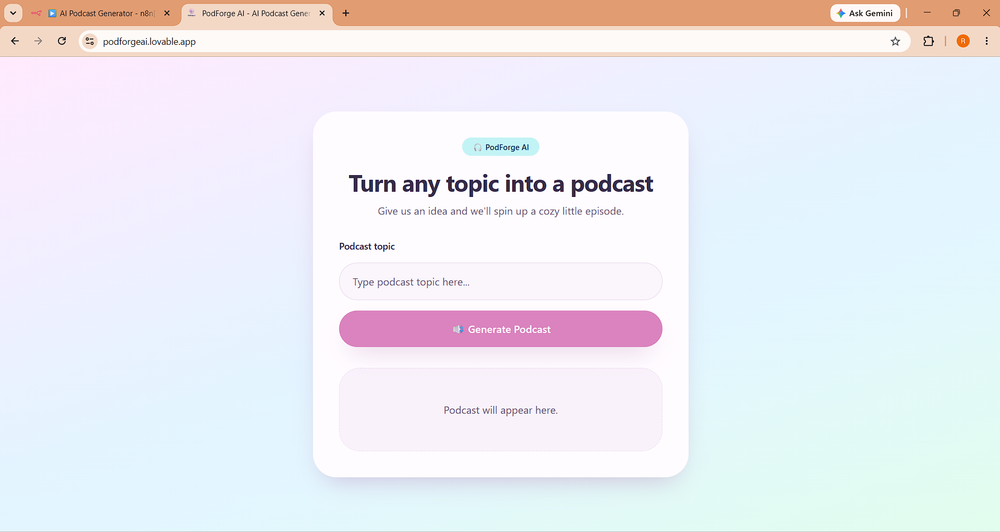
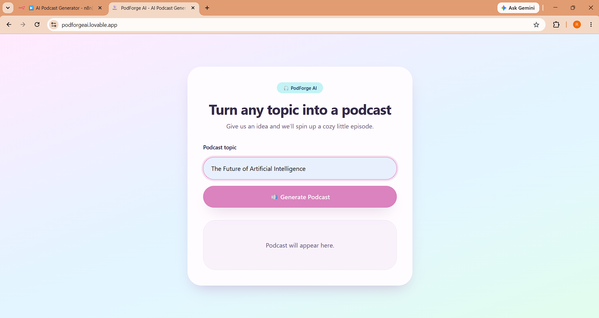
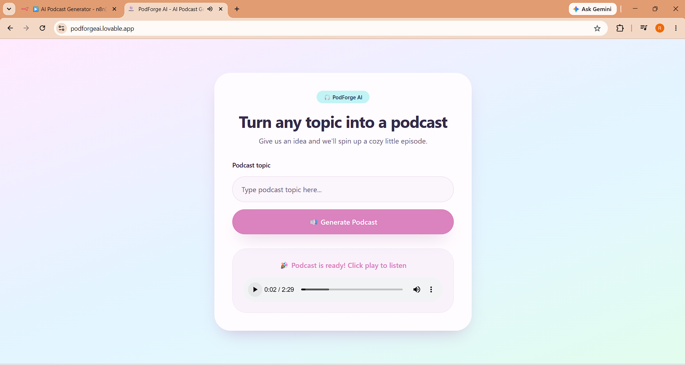
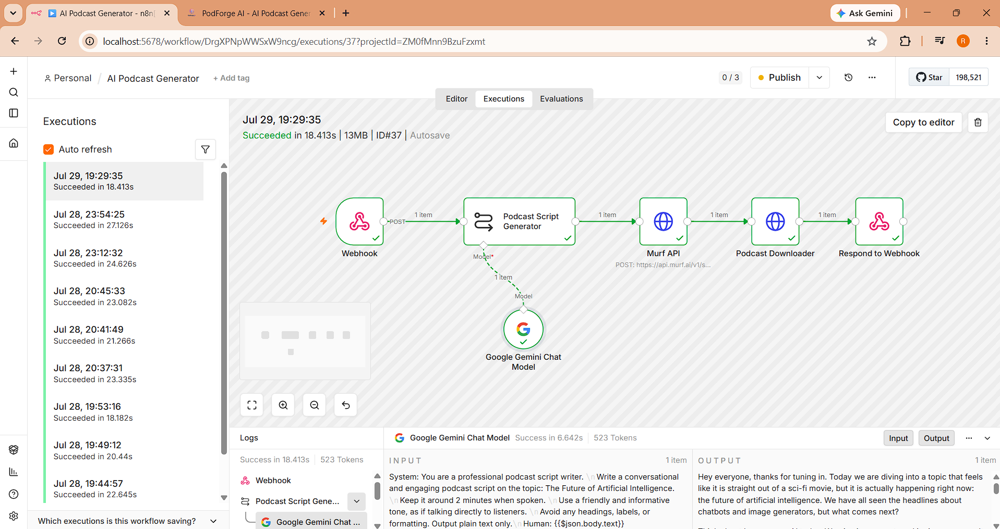

# 🎙️ PodForge AI


An AI-powered podcast generator that transforms any topic into a natural-sounding podcast using Google Gemini API, Murf API, and n8n workflow automation.

## 🌐 Live Demo

🔗 https://podforgeai.lovable.app

## 📖 Overview

PodForge AI is an end-to-end AI application that allows users to generate podcast episodes from any topic. The application generates a conversational script using Google Gemini API, converts it into realistic speech using the Murf API, and automates the complete workflow through n8n. The frontend is built with Lovable to provide a simple and intuitive user experience.

## 🚀 Highlights

- AI-powered podcast generation
- Google Gemini API integration
- Murf API for text-to-speech
- Automated workflow using n8n
- Frontend built with Lovable
- End-to-end API orchestration

## ✨ Features

- Generate podcast scripts from any topic
- Convert scripts into realistic voice narration
- Automated workflow using n8n
- Fast and responsive user interface
- End-to-end API integration

- ## 🛠️ Tech Stack

- Google Gemini API
- Murf API
- n8n
- Lovable
- HTTP APIs
- Webhooks
- Generative AI
  
## 📷 Screenshots

### Home Page



### User Input



### Generated Podcast



### n8n Workflow



## ⚙️ Workflow

```text
User
   │
   ▼
PodForge AI (Lovable)
   │
   ▼
Webhook
   │
   ▼
n8n Workflow
   │
   ├── Google Gemini API
   │
   └── Murf API
          │
          ▼
Podcast Audio
```
## 👨‍💻 Author

**Rudraksh Kawale**

- LinkedIn: https://www.linkedin.com/in/rudraksh-kawale/
- GitHub: https://github.com/Rudraksh6755
